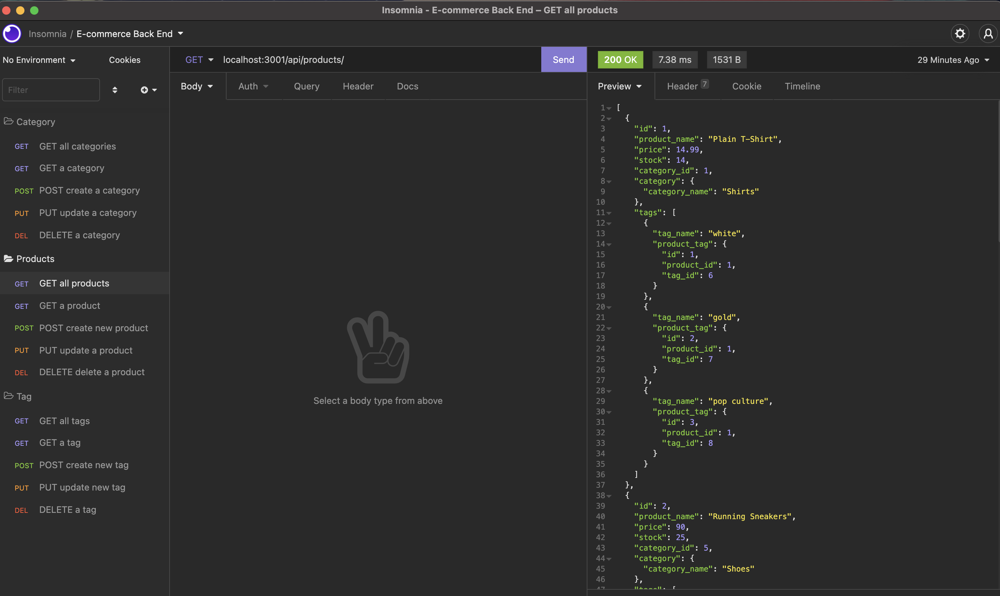

# E-commerce Back End

## Description
Internet retail, also known as e-commerce, is the largest sector of the electronics industry, having generated an estimated US$29 trillion in 2017 (Source: United Nations Conference on Trade and Development). E-commerce platforms like Shopify and WooCommerce provide a suite of services to businesses of all sizes. Due to the prevalence of these platforms, developers should understand the fundamental architecture of e-commerce sites.

This application is to build the back end for an e-commerce site and to take a working Express.js API and configure it to use Sequelize to interact with a MySQL database. 

This project uses the [Express](https://www.npmjs.com/package/express) and [MySQL2](https://www.npmjs.com/package/mysql2) and [Sequelize](https://www.npmjs.com/package/sequelize) packages to connect Express.js API to a MySQL database and the [dotenv package](https://www.npmjs.com/package/dotenv) to use environment variables to store sensitive data, like MySQL username, password, and database name.

User Story
- AS A manager at an internet retail company
- I WANT a back end for my e-commerce website that uses the latest technologies
- SO THAT my company can compete with other e-commerce companies

Acceptance Criteria
- GIVEN a functional Express.js API
- WHEN I add my database name, MySQL username, and MySQL password to an environment variable file
- THEN I am able to connect to a database using Sequelize
- WHEN I enter schema and seed commands
- THEN a development database is created and is seeded with test data
- WHEN I enter the command to invoke the application
- THEN my server is started and the Sequelize models are synced to the MySQL database
- WHEN I open API GET routes in Insomnia for categories, products, or tags
- THEN the data for each of these routes is displayed in a formatted JSON
- WHEN I test API POST, PUT, and DELETE routes in Insomnia
- THEN I am able to successfully create, update, and delete data in my database

## Table of Contents

* [Installation](#installation)
* [Usage](#usage)
* [License](#license)
* [Contributing](#contributing)
* [Tests](#tests)
* [Questions](#questions)
* [Links](#links)

## Installation

To use this application, please follow the following steps:
- Clone the repository using SSH - 'git@github.com:khanhlam90/ecommerce-backend.git'
- Run npm to install the Express, MySQL2, Sequelize and dotenv dependencies - 'npm install express mysql2 sequelize dotenv'
- Create a environment variable file (.env) and put in your crendentials (DB_NAME='ecommerce_db' DB_USER='yourusername' DB_PW='yourpassword'). Make sure to include this file(.env) in your .gitignore file!
- Create your database using MySQl Shell Command 'mysql -u username -p, enter your password'. Then run 'source db/schema.sql' to create the local database.
- Check if the database has been created successfully by entering the following in the command line - 'SHOW DATABASES;'
- Quit MySQl Shell Command - quit;
- Seed the tables data to your database so you can test your Routes using Insomnua - 'npm run seed'
- Start the server - 'npm start'

## Usage 
After the installation, please test scenarios in Insomnia - refer to demo video link below for details.

- [Link to the video demonstration of how to test the application](https://drive.google.com/file/d/1dOIsQX6iKE4rslfpm6SX-Iz_PuImZtch/view?usp=sharing)

- Screenshot of Testings in Insomnia:

## License

This project is using the MIT License.

## Contributing

Please feel free to contribute to this project - please find my info at the [Questions](#questions) section and contact me for more infomation.

## Tests

Please refer to [Usage](#usage) section.

## Questions

Please reach me using:

<a href = "mailto:khanhlam1990@yahoo.com"> My Email </a>

[My Github Account](https://github.com/khanhlam90)

## Project Links:
* [Demostration Video](https://drive.google.com/file/d/1dOIsQX6iKE4rslfpm6SX-Iz_PuImZtch/view?usp=sharing)
* [Github Repository](https://github.com/khanhlam90/ecommerce-backend.git)

